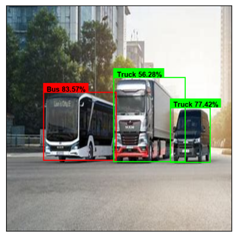

## Overview

As a beginner in Computer Vision, I wanted to work on Object Detection projects to build a strong portfolio. However, I wasn't satisfied with using the official YOLO models from Ultralytics out of the box. Although I understand how YOLO works theoretically, using it in practice often feels like a black box—you write a few lines of code, and the model handles everything. While that's convenient, it's not ideal for someone who wants to learn the inner workings of object detection.

So, I decided to build an object detection model from scratch. This allows me to experiment with ideas, design custom model architectures, and modify components of YOLO to potentially improve accuracy. The goal of this project is purely educational—to replicate the YOLO model, understand it deeply, and make it more transparent.

This implementation is inspired by YOLOv8 and uses certain parts (like TAL and the loss function) from the original Ultralytics codebase. I applied my model to an object detection dataset (e.g., the Bus-Truck dataset [Kaggle](https://www.kaggle.com/datasets/sixhky/open-images-bus-trucks)) and managed to achieve a mean Average Precision (mAP) and mAP50–95 close to what the original YOLO model produces.

---

## Project Structure

```
project/
│
├── yolo/                   # Using the original YOLO from Ultralytics on the dataset
│   ├── bus_truck.yaml      # Contains dataset paths and class names
│   ├── dataset.py          # Helper class to convert labels to YOLO format and split data into train/val
│   └── train_infer.ipynb   # Prepares the dataset and trains the original YOLO model and evaluate it on new images
│
├── dataset/                # Raw dataset folder
├── val_images/             # New images
│
├── yolo_dataset/           # Processed dataset for YOLO (generated by train.ipynb)
│
├── config.py               # Contains the custom model architecture
├── dataset.py              # Helper class to load the dataset
├── loss.py                 # Custom loss functions
├── tal.py                  # Task-Aligned Learning (TAL) module
├── engine.py               # Model manager: handles training, evaluation, and prediction
├── train_infer.ipynb       # trains the model and evaluate it on new images
└── utils.py                # Miscellaneous helper functions
```

## Model Comparison

The table below compares the performance of the original YOLO implementation and our custom implementation after just 10 epochs of training:

| Model            | Box Loss | Class Loss | DFL Loss | mAP@0.50 | mAP@0.50:0.95 |
|------------------|----------|------------|----------|----------|---------------|
| Original YOLO    | 1.066    | 1.174      | 1.531    | 0.685    | 0.502         |
| **our implementation** | 1.1867   | 1.3008     | 1.8203   | 0.6878   | 0.4959        |


## Results

Here’s an example of model predictions on validation data:




## Installation

### Prerequisites

- Python 3.12 or later
- Poetry (for dependency management)

### Steps

1. Clone the repository:
   ```bash
   git clone https://github.com/Almotasembelah/YOLO-from-Scratch.git
   ```
2. Navigate to the project directory:
   ```bash
   cd YOLO-from-Scratch
   ```
3. Install dependencies using Poetry:
   ```bash
   poetry install
   ```
---

## TODO

* **Change the config file into YAML format**
  → Improves readability and makes it easier to tune hyperparameters.

* **Add more evaluation metrics**
  → Include metrics such as **Recall (R)**, **Precision (P)**, **F1 Score**, and **per-class AP (Average Precision)** for a deeper performance analysis.

* **Implement class-wise confusion matrix**
  → Helps to understand misclassification between Bus and Truck classes.

  ---
